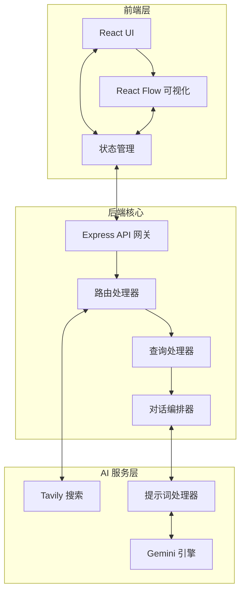

# 🐰 RabbitHoles — 开源知识探索工具
> 通过 AI 驱动的交互式思维导图，深入探索任何知识领域，发现意想不到的关联。

---

## 📖 目录

- [项目简介](#项目简介)
- [功能特性](#功能特性)
- [技术栈](#技术栈)
- [获取 API Key](#获取-api-key)
- [本地开发部署](#本地开发部署)
- [Docker 部署](#docker-部署)
- [Vercel 部署（推荐）](#vercel-部署推荐)
- [Railway 一键部署](#railway-一键部署)
- [环境变量说明](#环境变量说明)
- [项目结构](#项目结构)
- [JSON 导入/导出](#json-导入导出)
- [常见问题](#常见问题)
- [贡献指南](#贡献指南)

---

## 项目简介

RabbitHoles 是一款开源的知识探索工具，灵感来自同名应用。它结合了 **Tavily** 实时搜索和 **Google Gemini** 大语言模型，将你的提问转化为可交互的知识图谱，帮助你沿着知识的"兔子洞"不断深挖，发现主题之间的隐藏联系。

---

## 功能特性

- 🗺️ **交互式思维导图** — 基于 React Flow 的可视化知识网络
- 🤖 **AI 内容生成** — 由 Google Gemini 提供深度内容与追问建议
- 🔍 **实时网络搜索** — Tavily 搜索引擎提供最新资料与来源引用
- 🌿 **自定义分支** — 在搜索前预置自定义问题分支
- 💬 **追问功能** — 对任意主内容卡发起后续追问
- 📥 **JSON 导入/导出** — 保存与恢复探索会话（详见下方说明）
- 🌙 **暗色主题** — 精美的深色 UI 设计

---

## 技术栈

### 前端
| 技术 | 用途 |
|---|---|
| React + TypeScript | UI 框架 |
| React Flow | 知识图谱可视化 |
| Tailwind CSS | 样式 |
| Dagre | 图布局算法 |
| GSAP | 动画效果 |

### 后端
| 技术 | 用途 |
|---|---|
| Node.js + Express | Web 服务器 |
| TypeScript | 类型安全 |
| Tavily API | 网络搜索 |
| Google Gemini API | 大语言模型 |

---

## 获取 API Key

在部署前，你需要准备两个 API Key：

### 1. Tavily API Key（搜索服务）

1. 访问 [https://tavily.com](https://tavily.com)
2. 注册账号（支持 Google 登录）
3. 进入控制台 → **API Keys** → 点击 **Generate API Key**
4. 复制以 `tvly-` 开头的 Key

> 💡 Tavily 提供每月 **1,000 次免费搜索**，个人使用完全够用。

### 2. Google AI API Key（Gemini 模型）

1. 访问 [https://aistudio.google.com/app/apikey](https://aistudio.google.com/app/apikey)
2. 使用 Google 账号登录
3. 点击 **Create API key** → 选择或新建 Google Cloud 项目
4. 复制生成的 API Key

> 💡 Google AI Studio 提供 **免费配额**（gemini-1.5-flash 每分钟 15 次请求，每天 1500 次），个人探索使用完全免费。

---

## 本地开发部署

适合想要在本机运行或二次开发的用户。

### 前置要求

- **Node.js 18+** — [下载地址](https://nodejs.org/)
- **npm** 或 **yarn**
- Git

### 第一步：克隆项目

```bash
git clone https://github.com/AsyncFuncAI/rabbitholes.git
cd rabbitholes
```

### 第二步：安装依赖

```bash
# 在项目根目录执行（会同时安装 frontend 和 backend 的依赖）
npm install

# 如果根目录 install 不包含子目录，也可以分别安装：
cd frontend && npm install && cd ..
cd backend && npm install && cd ..
```

### 第三步：配置环境变量

在 `backend/` 目录下创建 `.env` 文件：

```bash
# backend/.env
PORT=3001
TAVILY_API_KEY=tvly-你的密钥
GOOGLE_AI_API_KEY=你的Gemini密钥
```

> ⚠️ **注意**：`.env` 文件已被 `.gitignore` 排除，不会被提交到 Git，请妥善保管密钥。

### 第四步：启动开发服务器

**方式一：同时启动前后端（推荐）**

```bash
# 在项目根目录执行
npm run dev
```

**方式二：分别启动**

```bash
# 终端 1 — 启动后端（端口 3001）
npm run backend:dev

# 终端 2 — 启动前端（端口 5173 或 3000）
npm run frontend:dev
```

### 第五步：访问应用

打开浏览器，访问：

```
http://localhost:5173
```

> 后端 API 运行在 `http://localhost:3001`，前端会自动代理请求。

---

## Docker 部署

适合在服务器上快速运行，无需配置 Node.js 环境。

### 前置要求

- **Docker** — [下载地址](https://www.docker.com/get-started)
- **Docker Compose**（Docker Desktop 已内置）

### 方式一：docker-compose（推荐）

1. 在项目根目录（与 `docker-compose.yml` 同级）创建 `.env` 文件：

```bash
# .env（放在 rabbitholes/ 根目录）
TAVILY_API_KEY=tvly-你的密钥
GOOGLE_AI_API_KEY=你的Gemini密钥
```

2. 启动容器：

```bash
docker-compose up -d
```

3. 访问应用：`http://localhost:3000`

4. 查看日志：

```bash
docker-compose logs -f
```

5. 停止服务：

```bash
docker-compose down
```

### 方式二：手动构建镜像

```bash
# 构建镜像
docker build -t rabbitholes .

# 运行容器（替换为你的密钥）
docker run -d \
  -p 3000:3000 \
  -e TAVILY_API_KEY=tvly-你的密钥 \
  -e GOOGLE_AI_API_KEY=你的Gemini密钥 \
  --name rabbitholes \
  rabbitholes
```

访问 `http://localhost:3000`

---

## Vercel 部署（推荐）

**Vercel 是部署 Next.js、React 和 Node.js 应用的最佳选择**。本教程提供两套方案：

### 方案一：分别部署前后端（推荐 ⭐）

这是最灵活的方案，前端通过 Vercel 静态托管，后端通过 Vercel Functions 运行。

#### 前置要求

- Vercel 账号（[免费注册](https://vercel.com)）
- GitHub 账号
- 你的仓库已推送到 GitHub

#### 步骤 1：前端部署

**1.1 连接仓库**

1. 访问 [https://vercel.com/new](https://vercel.com/new)
2. 使用 GitHub 账号登录或授权
3. 选择你的 RabbitHoles 仓库
4. 点击 **Import**

**1.2 配置项目**

在项目导入页面进行以下配置：

| 配置项 | 值 |
|---|---|
| Project Name | `rabbitholes` 或自定义 |
| Framework | **Next.js** → 不选（这是 Create React App） → 选 **Other** |
| Root Directory | `./frontend` |
| Build Command | `npm run build` |
| Output Directory | `build` |
| Install Command | `npm install` |

> 如果检测有 Root Directory，确保改为 `./frontend`

**1.3 添加环境变量**

在部署前，添加以下环境变量（可选，仅在前端需要时）：

| 变量名 | 值 | 说明 |
|---|---|---|
| `REACT_APP_API_URL` | `https://rabbitholes-api.vercel.app` | 后端 API 地址，部署后补充 |

> 这一步可以先跳过，部署后端后再修改。

**1.4 部署**

点击 **Deploy**，等待 5-10 分钟部署完成。完成后 Vercel 会展示你的前端域名，类似：

```
https://rabbitholes.vercel.app
```

保存这个域名。

---

#### 步骤 2：后端部署

后端通过 Vercel Functions 部署，完全免费。

**2.1 为后端创建 Vercel 配置文件**

确保 `backend/vercel.json` 已存在（项目中已有），内容如下：

```json
{
    "version": 2,
    "builds": [
        {
            "src": "api/index.ts",
            "use": "@vercel/node"
        }
    ],
    "routes": [
        {
            "src": "/api/(.*)",
            "dest": "/api/index.ts"
        }
    ],
    "functions": {
        "api/**/*.ts": {
            "maxDuration": 60
        }
    }
}
```

> 文件已存在于 `backend/vercel.json`，无需修改。

**2.2 创建 API 入口文件**

在 `backend/api/` 目录下创建 `index.ts`（如果尚未存在）：

```typescript
// backend/api/index.ts
import express, { Request, Response } from 'express';
import cors from 'cors';
import dotenv from 'dotenv';
import rabbitHoleRouter from '../src/routes/rabbithole';

dotenv.config();

const app = express();

// 中间件
app.use(cors({
    origin: [
        process.env.FRONTEND_URL || 'https://rabbitholes.vercel.app',
        'http://localhost:5173',
        'http://localhost:3000'
    ],
    credentials: true
}));
app.use(express.json({ limit: '10mb' }));

// API 路由
app.use('/api', rabbitHoleRouter);

// 健康检查
app.get('/api/health', (req: Request, res: Response) => {
    res.json({ status: 'ok', timestamp: new Date().toISOString() });
});

// 导出为 Vercel Serverless Function
export default app;
```

**2.3 同步仓库并部署到 Vercel**

推送代码到 GitHub：

```bash
git add .
git commit -m "feat: prepare for Vercel deployment"
git push origin main
```

然后在 Vercel 中：

1. 访问 [https://vercel.com/new](https://vercel.com/new)
2. 再次导入相同的仓库
3. 项目名改为 `rabbitholes-api`
4. Root Directory 改为 `./backend`
5. Build Command 改为 `npm run build`
6. 点击 **Environment Variables** 添加密钥：

   | 变量名 | 值 |
   |---|---|
   | `TAVILY_API_KEY` | tvly-你的密钥 |
   | `GOOGLE_AI_API_KEY` | 你的 Gemini 密钥 |
   | `FRONTEND_URL` | `https://rabbitholes.vercel.app` |（前端 Vercel 域名） |

7. 点击 **Deploy**，等待 5-10 分钟

部署完成后，后端域名类似：

```
https://rabbitholes-api.vercel.app
```

---

#### 步骤 3：联动前后端

**3.1 更新前端环境变量**

回到前端 Vercel 项目：

1. 进入 **Settings** → **Environment Variables**
2. 编辑或新增：
   - `REACT_APP_API_URL` = `https://rabbitholes-api.vercel.app`

> 前端默认会请求相对路径 `/api`，需要配置后端地址。

**3.2 重新部署前端**

在前端项目中，触发重新部署以应用新的环境变量：

1. 点击 **Deployments**
2. 找到最新的部署
3. 点击三个点 → **Redeploy**

或推送一个空提交触发重新部署：

```bash
git commit --allow-empty -m "trigger redeploy"
git push
```

**3.3 测试连接**

访问 `https://rabbitholes.vercel.app`，在浏览器开发者工具 (F12) 的 Network 面板中，确认 API 请求发送到 `https://rabbitholes-api.vercel.app/api`。

---

### 方案二：使用 Monorepo 整合部署

如果希望前后端在同一个 Vercel 项目中，使用 Monorepo 部署。

#### 配置根目录 vercel.json

在项目根目录创建 `vercel.json`：

```json
{
    "version": 2,
    "builds": [
        {
            "src": "backend/api/index.ts",
            "use": "@vercel/node"
        },
        {
            "src": "frontend/package.json",
            "use": "@vercel/static-build",
            "config": {
                "distDir": "build"
            }
        }
    ],
    "routes": [
        {
            "src": "/api/(.*)",
            "dest": "backend/api/index.ts"
        },
        {
            "src": "/(.*)",
            "dest": "frontend/$1"
        }
    ],
    "env": {
        "TAVILY_API_KEY": "@tavily_api_key",
        "GOOGLE_AI_API_KEY": "@google_ai_api_key"
    }
}
```

#### 部署步骤

1. 访问 [https://vercel.com/new](https://vercel.com/new)
2. 导入仓库
3. Project Name 保留默认
4. Root Directory **不填**（保持空，使用项目根目录）
5. Build Command：`npm run build && npm run copy-frontend`
6. Output Directory：`backend/dist`
7. 添加环境变量：
   - `TAVILY_API_KEY`
   - `GOOGLE_AI_API_KEY`
8. 点击 **Deploy**

部署后，前端、后端、API 都在同一个域名下：

```
https://rabbitholes.vercel.app     # 前端
https://rabbitholes.vercel.app/api # API
```

---

### Vercel 部署常见问题

**Q: 部署后提示 `Cannot find module`？**

> 确保 `backend/api/` 目录下有 `index.ts` 入口文件，且 `vercel.json` 配置正确。

**Q: Frontend API 请求 404？**

> 检查：
> 1. 前端环境变量 `REACT_APP_API_URL` 是否正确指向后端域名
> 2. 后端路由是否挂载在 `/api` 路径
> 3. CORS 配置是否包含前端域名

**Q: Build timeout？**

> Vercel 免费版本有 45 秒的 build 超时限制。如果构建过慢，可以：
> - 优化依赖，移除未使用的包
> - 在 `vercel.json` 中设置 `"buildCommand": "npm ci"` 而不是 `npm install`
> - 考虑升级到 Pro 版本（有更多构建额度）

**Q: 如何查看部署日志？**

> 在 Vercel 项目中：
> 1. 点击 **Deployments**
> 2. 选择对应部署
> 3. 点击 **Logs** 查看构建和运行日志

---

## Railway 一键部署

适合想要快速上线公网访问的用户，Railway 提供免费试用额度。

### 步骤

1. 点击顶部的 **Deploy on Railway** 按钮
2. 使用 GitHub 账号登录 Railway
3. Fork 这个仓库（Railway 需要访问你的 GitHub）
4. 在 Railway 项目设置中添加环境变量：

   | 变量名 | 值 |
   |---|---|
   | `TAVILY_API_KEY` | tvly-你的密钥 |
   | `GOOGLE_AI_API_KEY` | 你的Gemini密钥 |

5. Railway 会自动检测 `Dockerfile` 并开始构建，约 2-5 分钟后部署完成
6. 在 Railway 控制台获取你的公网访问域名

---

## 环境变量说明

### 后端变量（`backend/.env`）

| 变量名 | 必填 | 默认值 | 说明 |
|---|---|---|---|
| `PORT` | 否 | `3001` | 后端监听端口 |
| `TAVILY_API_KEY` | **是** | — | Tavily 搜索 API Key |
| `GOOGLE_AI_API_KEY` | **是** | — | Google Gemini API Key |

### 前端变量（开发时可选）

| 变量名 | 默认值 | 说明 |
|---|---|---|
| `REACT_APP_API_URL` | `/api` | 后端 API 地址（生产环境走同域代理） |

> 本地开发时前端默认请求 `http://localhost:3001/api`，通过 Vite 代理自动转发。

---

## 项目结构

```
rabbitholes/
├── frontend/                      # React 前端应用
│   ├── src/
│   │   ├── components/
│   │   │   ├── SearchView.tsx     # 主页面（搜索 + 画布）
│   │   │   ├── RabbitFlow.tsx     # React Flow 画布组件
│   │   │   ├── CustomBranchInput.tsx  # 自定义分支输入
│   │   │   └── nodes/
│   │   │       └── MainNode.tsx   # 主内容卡节点
│   │   ├── services/
│   │   │   └── api.ts             # API 请求封装
│   │   └── styles/
│   └── package.json
│
├── backend/                       # Express 后端服务
│   ├── src/
│   │   ├── server.ts              # 服务器入口
│   │   ├── routes/
│   │   │   └── rabbithole.ts      # 核心 API 路由
│   │   └── services/
│   │       └── openaiService.ts   # AI 服务调用
│   ├── .env                       # 环境变量（自行创建）
│   └── package.json
│
├── rabbitholes-main-template.json  # JSON 模板：完整主内容卡
├── rabbitholes-branch-template.json # JSON 模板：分支问题预置
│
├── Dockerfile                     # 生产镜像构建文件
├── docker-compose.yml             # Docker Compose 配置
├── railway.toml                   # Railway 部署配置
└── package.json                   # 根工作区配置
```

---

## JSON 导入/导出

应用支持将整个探索会话保存为 JSON 文件，并在之后重新导入恢复。

### 导出

在画布界面左上角点击 **「导出 JSON」** 按钮，浏览器将自动下载一个 `.json` 文件，包含当前所有节点、边、问题和对话历史。

### 导入（完整会话）

1. 点击左上角 **「导入 JSON」** 按钮（在搜索首页或画布页均可操作）
2. 选择之前导出的 `.json` 文件
3. 画布将自动恢复到导出时的状态

### 导入（仅分支模板）

项目根目录提供了 `rabbitholes-branch-template.json` 文件，可以在搜索**之前**导入，预置自定义分支问题。在搜索首页点击 **「导入 JSON」** 并选择该文件，分支问题标签将自动填充。

---

## 常见问题

**Q: 启动后访问页面一直 loading？**
> 检查 `backend/.env` 中的 API Key 是否正确配置，打开浏览器开发者工具 Network 面板查看报错信息。

**Q: 报错 `TAVILY_API_KEY is not defined`？**
> 确保在 `backend/` 目录下创建了 `.env` 文件，且文件中没有多余的空格（`KEY= value` 应改为 `KEY=value`）。

**Q: 前端启动后提示 `Cannot find module`？**
> 分别在 `frontend/` 和 `backend/` 目录各执行一次 `npm install`。

**Q: Docker 构建失败？**
> 确保 Docker 守护进程已启动，并且网络可以访问 npm 镜像源。国内用户可以在 Dockerfile 中配置 npm 镜像。

**Q: Railway 部署后前端无法访问 API？**
> Railway 会将前后端合并为单个服务，前端请求会通过同域 `/api` 路径转发，无需额外配置。

---

## 系统架构



---

## 贡献指南

欢迎提交 Pull Request！

1. Fork 本仓库
2. 创建功能分支：`git checkout -b feature/新功能名称`
3. 提交更改：`git commit -m 'feat: 添加某某功能'`
4. 推送分支：`git push origin feature/新功能名称`
5. 发起 Pull Request

---

## 许可证

本项目基于 [MIT License](LICENSE) 开源。
原项目: https://github.com/AsyncFuncAI/rabbitholes

---

Built with ❤️ | Powered by [Tavily](https://tavily.com) & [Google Gemini](https://aistudio.google.com)
